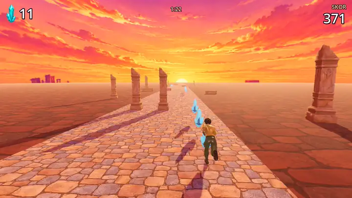

# Sonsuz Koşu

Üç şeritli sonsuz koşu oyunu. Şerit değiştir, bariyerlerin ve arabaların üstünden atla, kristalleri topla ve giderek hızlanan 90 saniyelik turu tamamla.

Bu oyunu [bir YouTube videosu](https://www.youtube.com/watch?v=ooOnOUPlCF0) için yaptık. Kodu Godot 4.7'de Claude Code (Opus 5.5) yazdı; bütün modeller, dokular ve müzik [Higgsfield](https://higgsfield.ai/s/claude-opus-5-5-yt-yusufipk-kKcOju) ile üretildi.

## Oyna

[Releases](https://github.com/yusufipk/sonsuz-kosu/releases/latest) sayfasından sistemine uygun dosyayı indir ve çalıştır, kurulum gerekmiyor.

- **Windows:** `SonsuzKosu.exe`. Dosya imzalı olmadığı için SmartScreen uyarı verebilir: "Ek bilgi"ye, sonra "Yine de çalıştır"a tıkla.
- **Linux:** `chmod +x SonsuzKosu.x86_64 && ./SonsuzKosu.x86_64`

Vulkan destekleyen bir ekran kartı gerekiyor (Windows'ta Direct3D 12 de yeterli).

## Kontroller

- **A / D** ya da **Sol / Sağ ok:** şerit değiştir
- **Boşluk**, **W** ya da **Yukarı ok:** zıpla
- **R:** yeniden başla

## Kaynak koddan çalıştır

`project.godot` dosyasını [Godot 4.7](https://godotengine.org/download) ile aç ve F5'e bas.

## Lisans

Kod MIT lisanslı. `assets/` klasöründeki modeller, dokular ve müzik bu lisansın kapsamında değil.
