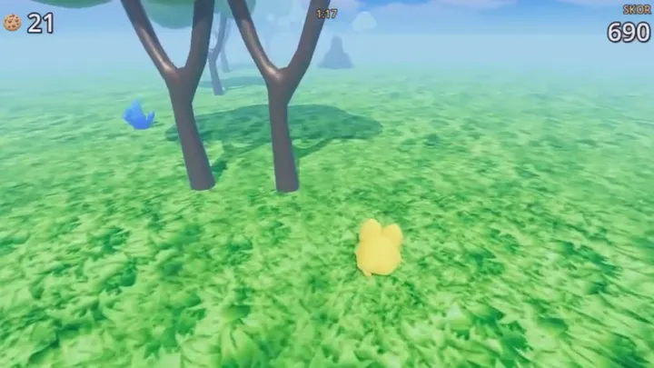

# Sonsuz Koşu Bebiş

## Oyna

[Releases](https://github.com/bebisland/yusufipk-sonsuz-kosu-bebis/releases) sayfasından sistemine uygun dosyayı indir ve çalıştır, kurulum gerekmiyor.

- **Windows:** `SonsuzKosuBebis.exe`. Dosya imzalı olmadığı için SmartScreen uyarı verebilir: "Ek bilgi"ye, sonra "Yine de çalıştır"a tıkla.
- **Linux:** `chmod +x SonsuzKosuBebis.x86_64 && ./SonsuzKosuBebis.x86_64`

Vulkan destekleyen bir ekran kartı gerekiyor (Windows'ta Direct3D 12 de yeterli).

## Kontroller

- **A / D** ya da **Sol / Sağ ok:** şerit değiştir
- **Boşluk**, **W** ya da **Yukarı ok:** zıpla
- **R:** yeniden başla

## Kaynak koddan çalıştır

`project.godot` dosyasını [Godot 4.7](https://godotengine.org/download) ile aç ve F5'e bas.

## Lisans

Kod MIT lisanslı. `assets/` klasöründeki modeller, dokular ve müzik bu lisansın kapsamında değil.
